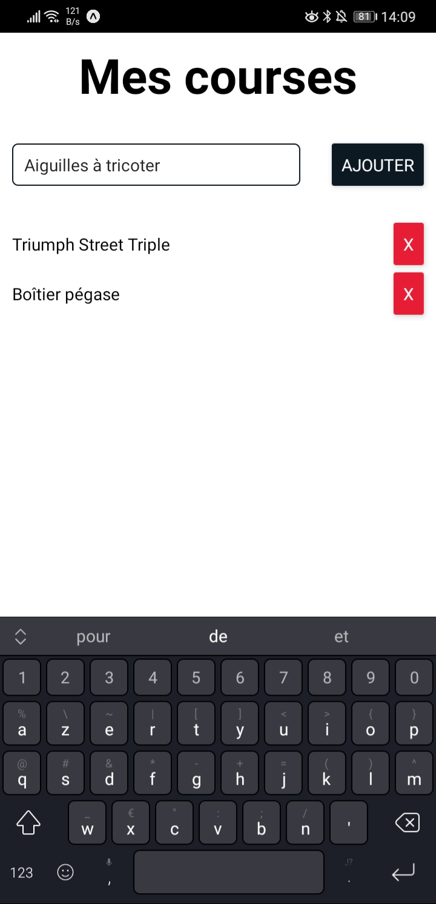

# SMT PERFORMANCES

Réaliser une application de liste de course en utilisant React Native et TS. L'application doit permettre d'ajouter et supprimer des articles. 
Ne pas passer plus de 3h sur le projet.

